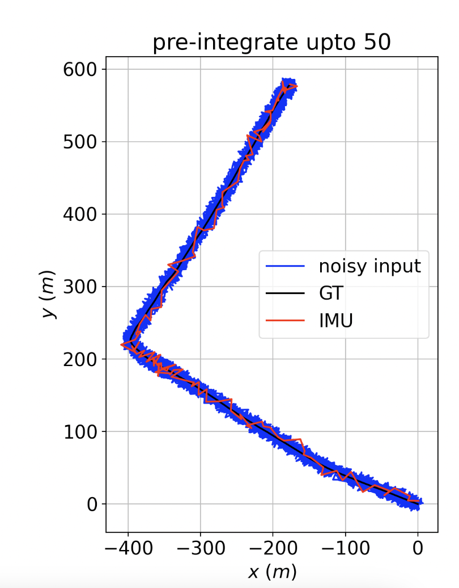

# gtsam-io
Inertial Odometry using GTSAM

# Purpose:
Demonstrate sensor fusion for correcting noisy GPS pose using IMU (IO). The input signals are generated by adding noise (upto 50m) to the GPS data.

# Installation:
Install GTSAM and its python bindings as per official instructions. 
After cloning this repo:
```sh
#!bash
$ git submodule update --init --recursive
$ conda create -n gtsam
$ conda activate gtsam
$ pip3 install -r requirements.txt
```

# Usage:

Run Inertial Odometry for sequence, skipping every 10th frame and using the first 6000 frames/datapoints available using the following command:

```sh
#!bash
$ python3 src/icin.py --n_skip 10 --n_frames 6000
```



* Increasing pre-integration sample size (by increasing `n_skip`), can lead to smoother results as shown below.
* Upto 5 samples: 
* Upto 10 samples: 
* Upto 25 samples: 
* Upto 50 samples: 

## Data convention:
Most GTSAM samples are explained and tested on the KITTI dataset which follows the FLU convention for sensor frames. As it describes:
```t
vf:    forward velocity, i.e. in direction of vehicle/parallel to earth-surface (m/s)
vl:    leftward velocity, i.e. parallel to earth-surface (m/s)
vu:    upward velocity, i.e. perpendicular to earth-surface (m/s)
af:    forward acceleration in direction of vehicle(m/s^2)
al:    leftward acceleration in direction of vehicle left(m/s^2)
au:    upward acceleration (m/s^2)
wf:    angular rate around forward axis (rad/s)
wl:    angular rate around leftward axis (rad/s)
wu:    angular rate around upward axis (rad/s)
```

The IMU's axes align with vehicle axes as follows:
| |x-axis|y-axis|z-axis|
|--|--|--|--|
| IMU | Forward | Leftward | Upward|

As my data lacks any `vl` or `vu`, I will replace them with a placeholder velocity of 0.1m/s^2. Also, for a vehicle travelling over earth's surface, its unusual to have significant omega (angular rate) in any direction other than the axis perpendicular to earth surface. A typical vehicle data contains `wu` of magnitudes higher as shown:
. 

Similarly, linear acceleration in earth's direction is actually `au` or earth's gravitation. `ax` or `ay` can be used as `af` depending on which axis coincides with the front direction of the vehicle. In my case, `ax` is same as `af`.
. 

# Notes:

Number of nodes/elements:

In `self.graph`:
- x0, b0, v0 : one time
for every pair of image:
- `BetweenFactorConstantBias` factor b/w b_n and b_n-1
- `ImuFactor`

In `initial_estimates`:
for every image n: 
- x_n, b_n, v_n
- (if track found from superpoint output) `GenericProjectionFactorCal3_S2`